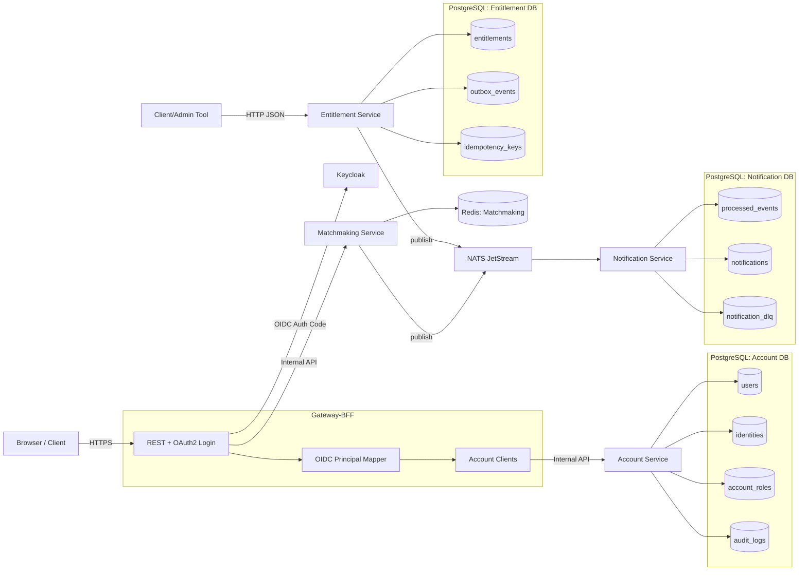
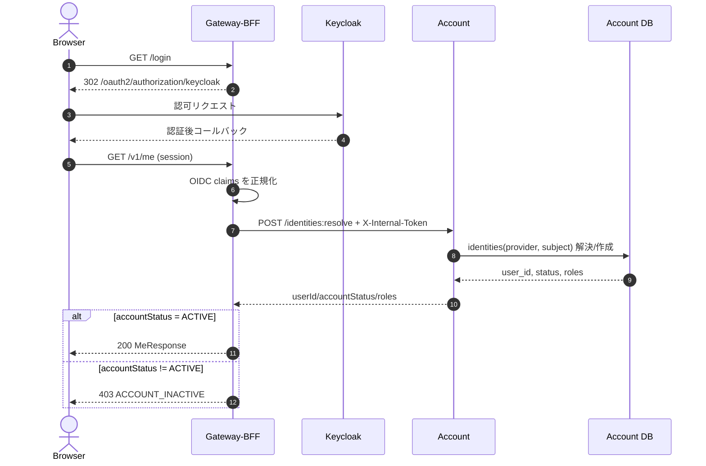
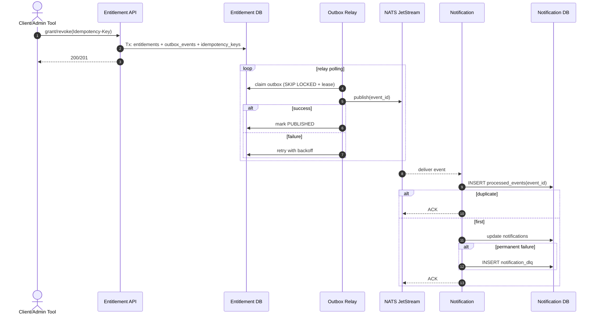

# Architecture MiniServerSystem

- どこで: `docs/architecture.md`
- 何を: MiniServerSystem 全体（Gateway-BFF / Account / Entitlement / Matchmaking / Notification / Keycloak / NATS / Redis）のアーキテクチャを定義する
- なぜ: 実装と運用判断の前提を 1 つの文書で共有し、サービス追加時の整合性崩れを防ぐ

## 1. この文書の責務

この文書が扱う内容:
- システム境界と主要コンポーネント
- 認証・認可と信頼境界
- 同期 API フローと非同期イベントフロー
- 整合性・冪等性・障害時の収束方針
- 主要な設計判断と既知のギャップ

この文書が扱わない内容:
- SLO/SLI/アラート閾値（`docs/slo.md`）
- 障害モードの網羅一覧（`docs/failure-modes.md`）
- 障害時の具体オペレーション（`docs/runbook.md`）

## 2. 目的と非ゴール

### 2.1 目的
- OIDC ログイン後に業務ユーザー（`account` の user）へ安定的に解決する
- ユーザー情報の正本を `account` に集約し、BFF は集約・仲介に徹する
- 権利状態の正本を `entitlement` に置き、変更イベントを `notification` に確実伝播する
- マッチメイク待ち行列を `matchmaking + Redis` で管理し、成立イベントを `notification` に確実伝播する
- 再送・重複・一時障害を前提に、安全に最終収束する

### 2.2 非ゴール
- マルチリージョン厳密整合
- グローバルな厳密全順序

## 3. システム境界とコンポーネント

### 3.1 Context
- Browser/Client は `gateway-bff` にアクセスする
- `gateway-bff` は OIDC Provider（Keycloak）で認証を行う
- `gateway-bff` は内部 API として `account` を呼び出す
- `gateway-bff` は内部 API として `matchmaking` を呼び出す
- `entitlement` はドメインイベントを NATS JetStream に publish する
- `matchmaking` は成立イベントを NATS JetStream に publish する
- `matchmaking` はチケット・キュー状態を Redis で管理する
- `notification` はイベントを購読し通知データを更新する

### 3.2 Container
- Gateway-BFF Service（OAuth2 Login, API Aggregation）
- Account Service（Identity Resolve, User Profile, Admin Action）
- Entitlement Service（権利正本 + Outbox Relay）
- Matchmaking Service（Join/Status/Cancel API + Worker によるマッチ成立処理）
- Notification Service（購読処理 + 送信状態管理 + DLQ）
- Keycloak（OIDC Provider）
- NATS JetStream（イベントブローカー）
- Redis（Matchmaking チケット・キュー・冪等キーの正本）
- PostgreSQL（単一インスタンス上で `account` / `entitlement` / `notification` schema を分離）

## 4. コンポーネント責務

### 4.1 Gateway-BFF
主責務:
- `/login` を入口に OIDC Authorization Code Flow へ誘導
- 認証後 principal から OIDC claims を抽出し `account` で業務ユーザー解決
- `/v1/me` で userId/accountStatus/roles を返却
- `/v1/users/{userId}` と `/v1/users/{userId}` PATCH を `account` へ委譲
- `/v1/matchmaking/queues/{mode}/tickets` / `/v1/matchmaking/tickets/{ticketId}` を `matchmaking` へ委譲
- `/v1/users/{userId}/profile` の集約 API を提供（現時点はスケルトン）

実装上の重要点:
- `GatewaySecurityConfig` で `oauth2Login()` を有効化
- 未認証時 `/v1/me` は `401` を返す
- `/logout` は CSRF 前提で `204 No Content`（CSRF なしは `403`）
- `account` 呼び出し時に内部トークンと転送ユーザーヘッダーを付与

### 4.2 Account
主責務:
- `POST /identities:resolve` で `provider + subject` を業務 userId に解決
- `GET/PATCH /users/{userId}` でユーザー情報参照・更新
- `POST /admin/users/{userId}:suspend` で停止操作と監査ログ記録

実装上の重要点:
- 初回解決時は `UUID.nameUUIDFromBytes(provider:subject)` による決定論的 userId 生成
- 競合時（一意制約違反）は勝者レコード再読込で収束
- role 初期付与は `USER`
- suspend 時は `audit_logs` へ操作記録を永続化

### 4.3 Entitlement
主責務:
- 権利状態の正本管理
- 同一トランザクションで outbox へイベント記録
- Relay で JetStream へ publish

### 4.4 Notification
主責務:
- JetStream からイベント購読
- `processed_events` による重複排除
- `notifications` を最終的に `SENT` または `FAILED` へ収束
- 恒久失敗の DLQ 隔離

### 4.5 Matchmaking
主責務:
- `POST/GET/DELETE /v1/matchmaking/**` で ticket の Join/Status/Cancel を提供
- ticket と queue を Redis に保存し、`idempotency_key` で Join 冪等を担保
- `MatchmakerWorker` が mode ごとに queue をポーリングし、2件成立時に `MATCHED` へ遷移
- マッチ成立時に `matchmaking.events` を NATS JetStream へ publish

実装上の重要点:
- mode は `casual` / `rank` のみ許容
- `party_size` は現時点 `1` のみ許容（1vs1前提）
- queue 取り出し・2件成立・status 更新は Lua（`match_two.lua`）で原子的に実行
- `GET` 時に期限超過 ticket を `EXPIRED` へ遷移し queue から除去

## 5. 認証・認可と信頼境界

### 5.1 外部境界（Browser ↔ Gateway-BFF）
- 認証方式は OAuth2/OIDC（Authorization Code Flow）
- 認証状態は Spring Security セッションで保持
- BFF 公開 API は未認証を `401` で拒否

### 5.2 内部境界（Gateway-BFF ↔ Account）
- 共有トークンヘッダー（既定 `X-Internal-Token`）で内部呼び出しを識別
- `GET/PATCH /users/{userId}` では追加ヘッダーを転送
- `X-User-Id`: 呼び出し主体 userId
- `X-User-Roles`: 呼び出し主体 roles（`,` 区切り）

### 5.3 内部境界（Gateway-BFF ↔ Matchmaking）
- `gateway-bff` は認証済み主体を `X-User-Id` として `matchmaking` に転送する
- `matchmaking` は ticket 所有者チェック（`ticket.user_id == X-User-Id`）で参照/取消を保護する
- 外部クライアントは `matchmaking` を直接呼ばず、境界は `gateway-bff` に集約する

### 5.4 Account 側の認可判定
- `POST /identities:resolve` は `ROLE_INTERNAL` 必須
- `/admin/**` は `ROLE_ADMIN` 必須
- `GET/PATCH /users/{userId}` は所有者一致で許可
- `ROLE_ADMIN` は所有者チェックをバイパス

## 6. データモデル（要点）

### 6.1 Account DB
- `users(user_id PK, display_name, locale, status, created_at, updated_at)`
- `identities(provider, subject PK, user_id FK, email, email_verified, created_at)`
- `account_roles(user_id, role PK, created_at)`
- `audit_logs(id PK, actor_user_id, action, target_user_id, metadata_json, created_at)`

インデックス:
- `identities_user_id_idx`
- `audit_logs_target_created_idx`

### 6.2 Entitlement DB
- `entitlements`: 権利状態の正本
- `idempotency_keys`: API 冪等制御
- `outbox_events`: publish 前後状態の管理

### 6.3 Notification DB
- `processed_events`: event_id 重複排除
- `notifications`: 通知状態管理
- `notification_dlq`: 恒久失敗イベント隔離
- `notification_nats_dlq`: JetStream advisory（MaxDeliver / MSG_TERMINATED）由来の stream_seq 保持

### 6.4 Matchmaking Redis
- `mm:ticket:{ticketId}`（Hash）:
`user_id`, `mode`, `status(QUEUED|MATCHED|CANCELLED|EXPIRED)`, `created_at`, `expires_at`, `expires_at_epoch_millis`, `attributes`, `match_id`
- `mm:queue:{mode}`（Sorted Set）: member=`ticketId`, score=`enqueue epoch millis`
- `mm:idemp:{userId}:{mode}:{idempotencyKey}`（String）: Join 冪等用の `ticketId`

## 7. 主要フロー

### 7.1 ログインと `/v1/me`
1. Browser が `GET /login`（gateway-bff）
2. gateway-bff は `302 /oauth2/authorization/keycloak`
3. Keycloak 認証後 `/login/oauth2/code/keycloak` へ戻る
4. Browser が `GET /v1/me`
5. gateway-bff が principal を `OidcClaims` に正規化
6. gateway-bff が `account /identities:resolve` を内部トークン付きで呼び出す
7. account が userId/status/roles を返却
8. gateway-bff は `status == ACTIVE` のみ許可しレスポンス返却

### 7.2 ユーザー参照・更新
1. Browser が `GET/PATCH /v1/users/{userId}` を呼ぶ
2. gateway-bff が呼び出し主体を解決（OIDC → account resolve）
3. gateway-bff が `X-Internal-Token`, `X-User-Id`, `X-User-Roles` を付与して account 呼び出し
4. account が所有者または admin を許可し、結果を返却

### 7.3 管理者停止
1. 管理者権限主体が `POST /admin/users/{userId}:suspend` 実行
2. account が対象 user status を `SUSPENDED` へ更新
3. account が `audit_logs` に監査記録を挿入

### 7.4 権利更新イベント
1. 決済サービス等外部サービス が entitlement API へ grant/revoke
2. entitlement が同一 Tx で `entitlements` と `outbox_events` を更新
3. Relay が outbox claim 後に JetStream publish
4. notification が受信し `processed_events` で重複排除
5. 通知処理結果を `notifications` に反映、必要時 DLQ 隔離

### 7.5 Matchmaking Join〜成立
1. Browser が `POST /v1/matchmaking/queues/{mode}/tickets` を `gateway-bff` へ実行
2. gateway-bff が OIDC 主体を業務 userId に解決し、`X-User-Id` 付きで matchmaking を呼ぶ
3. matchmaking が `idempotency_key` を評価し、再送時は既存 ticket を返す
4. matchmaking が `mm:ticket:*` と `mm:queue:{mode}` を作成し `QUEUED` を返す
5. `MatchmakerWorker` が `mm:queue:{mode}` から 2 件を Lua で原子的に成立させる
6. matchmaking が `matchmaking.events` に `MATCH_FOUND` を publish する
7. notification が同イベントを購読して `processed_events` で冪等処理し、通知を `PENDING` 登録する

## 8. 整合性・冪等性・失敗時収束

### 8.1 同期 API
- entitlement API は `Idempotency-Key` で再送安全化
- account identity resolve は `provider + subject` 一意制約で収束
- account resolve の並行生成は再読込フォールバックで単一 user に合流

### 8.2 非同期イベント
- outbox 採用で DB 更新とイベント記録の論理一貫性を担保
- publish は at-least-once 前提（重複は許容）
- consumer 側で `processed_events` により冪等吸収

### 8.3 BFF の外部障害吸収
- account 側の 401/403/5xx/タイムアウト/不正レスポンスを `AccountIntegrationException` に正規化
- API エラーは `502/504` などへ変換
- `accountStatus != ACTIVE` は `403 ACCOUNT_INACTIVE`
- Istio `VirtualService` で `gateway-bff -> account` に timeout（既定 `1s`）を設定し、遅延時に早期失敗させる
- Istio retry は `GET /users/{userId}` と冪等な `POST /identities:resolve` に限定して適用する
- Istio `DestinationRule` で `gateway-bff -> account` に connectionPool / outlierDetection を設定する
- Istio `VirtualService` で `gateway-bff -> matchmaking` に timeout（既定 `10s`）を設定し、`Matchmaking SLI-B (p95<10s)` の観点で上限を揃える
- Istio retry は `GET/DELETE /v1/matchmaking/tickets/{ticketId}` の冪等操作に限定し、`POST /v1/matchmaking/queues/{mode}/tickets` には適用しない
- Istio `DestinationRule` で `gateway-bff -> matchmaking` に connectionPool / outlierDetection を設定し、簡易な CB を mesh 層で有効化する

### 8.4 Matchmaking の収束戦略
- Join は `mm:idemp:*` により同一 `idempotency_key` を既存 ticket に束ねる
- Cancel は `QUEUED -> CANCELLED` の遷移のみを許可し、他状態は現状維持で冪等に応答する
- TTL 失効 ticket は参照時と Lua 実行時の双方で除外し、stale ticket による誤マッチを抑止する
- マッチ成立 publish は at-least-once 前提で、notification 側の `processed_events` で重複吸収する

## 9. デプロイと設定

### 9.1 Keycloak（local/ci）
- Keycloak を infra に常設し OIDC Provider として利用
- local は `keycloak.localhost` からブラウザアクセス
- gateway-bff は `authorization/token/userinfo/jwk-set` の各 URI を環境変数で受ける

### 9.2 内部 API 設定
gateway-bff 側:
- `ACCOUNT_BASE_URL`
- `ACCOUNT_INTERNAL_API_HEADER_NAME`（既定 `X-Internal-Token`）
- `ACCOUNT_INTERNAL_API_TOKEN`
- `ACCOUNT_USER_ID_HEADER_NAME`（既定 `X-User-Id`）
- `ACCOUNT_USER_ROLES_HEADER_NAME`（既定 `X-User-Roles`）

account 側:
- `account.internal-api.header-name`
- `account.internal-api.token`
- `account.internal-api.user-id-header-name`
- `account.internal-api.user-roles-header-name`

### 9.3 Matchmaking 設定
gateway-bff 側:
- `MATCHMAKING_BASE_URL`
- `MATCHMAKING_JOIN_TICKET_PATH`
- `MATCHMAKING_GET_TICKET_PATH`
- `MATCHMAKING_CANCEL_TICKET_PATH`
- `MATCHMAKING_USER_ID_HEADER_NAME`（既定 `X-User-Id`）

matchmaking 側:
- `matchmaking.ticket-ttl`
- `matchmaking.idempotency-ttl`
- `matchmaking.worker-poll-interval`
- `matchmaking.worker-batch-size`
- `matchmaking.nats.subject`（既定 `matchmaking.events`）
- `matchmaking.nats.stream`（既定 `matchmaking-events`）

## 10. 観測設計（責務のみ）

- 各サービスはメトリクス・ログ・トレースを出力する
- gateway-bff では OIDC 失敗と account 連携失敗を識別可能にする
- entitlement/notification では outbox 滞留・再試行・DLQ 増加を監視対象にする
- matchmaking では `mm.time_to_match` / `mm.queue.depth` / `mm.queue.oldest_age` / `mm.match.total` を監視対象にする
- 分散トレースは OpenTelemetry Java Agent を `gateway-bff` / `account` / `entitlement` / `notification` に適用し、OTLP で OpenTelemetry Collector に送る
- `entitlement -> NATS -> notification` と `matchmaking -> NATS -> notification` の非同期経路も trace context を伝播対象に含める（計装の有効化を前提）
- アプリログは JSON 構造化して出力し、`trace_id` / `span_id` を MDC から埋め込んでトレースと突合可能にする
- 追加の運用キーとして `request_id` / `user_id` / `http_method` / `http_path` / `client_ip` / `idempotency_key` をMDCに格納し、notification の NATS 消費では `event_id` / `event_type` / `source_id` も出力する

詳細は以下へ分離:
- `docs/slo.md`
- `docs/failure-modes.md`
- `docs/runbook.md`

## 11. 既知のギャップ

- `/v1/users/{userId}/profile` は現時点で実データ集約未実装（プレースホルダー）
- gateway-bff → account / matchmaking のアプリレイヤーCB（Resilience4j 等）は未導入（Istioのtimeout/retry/connectionPool/outlierDetectionは導入済み）
- 内部 API は Istio mTLS(STRICT) + AuthorizationPolicy でゼロトラスト化し、共有トークン方式はアプリレイヤーの追加ガードとして併用する
- Matchmaking のセッション情報生成（peer_user_ids / session payload）は現状プレースホルダーで、対戦接続情報の確定仕様は未反映

## 12. 主要設計判断

- 認証境界は BFF で一元化し、バックエンドは内部 API で分離する
- account をユーザー正本にし、OIDC subject と業務 userId の対応を吸収する
- イベント伝播は outbox + at-least-once + consumer 冪等で実運用耐性を優先する
- 障害時の可観測性と運用介入可能性（DLQ、監査ログ）を重視する

## 13. 関連ドキュメント

- OIDC + account/bff 詳細設計: `docs/design/20260215_1_account_bff_oidc.md`
- Matchmaking 詳細設計: `docs/design/20260225_1_matchmaking.md`
- 信頼性目標: `docs/slo.md`
- 障害カタログ: `docs/failure-modes.md`
- 復旧手順: `docs/runbook.md`

## コンポーネント図

## シーケンス図（ログイン〜業務ユーザー解決）

## シーケンス図（Entitlement イベント伝播）

