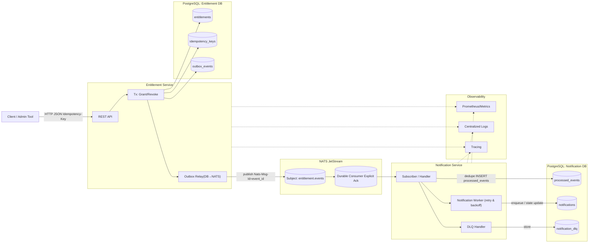
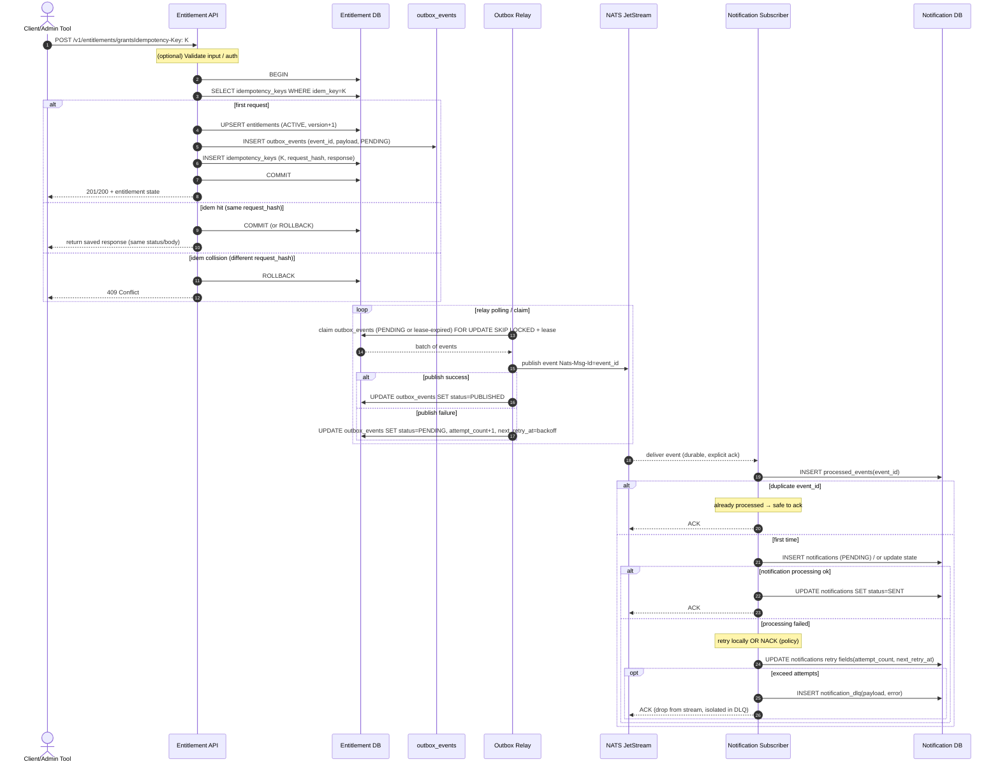

# Architecture Entitlement Service + Notification Service

このドキュメントは MiniServerSystem のうち、Entitlement と Notification を中心としたアーキテクチャを定義する。
目的は「構成」「データフロー」「整合性保証」を一か所で管理すること。

## 1. この文書の責務

扱う内容:
- システム境界と主要コンポーネント
- 同期/非同期のデータフロー
- 整合性と冪等性の設計
- 技術的な設計判断

扱わない内容:
- SLO/SLI/アラート閾値（`docs/slo.md`）
- 障害モードの一覧（`docs/failure-modes.md`）
- 障害時の具体的オペレーション（`docs/runbook.md`）

## 2. 目的と非ゴール

### 2.1 目的
- 権利データの正本を RDB で一貫して管理する
- 権利変更をイベントとして確実に通知系へ伝播する
- 再送/重複が発生しても最終的に安全に収束させる

### 2.2 非ゴール
- マルチリージョン厳密整合
- 厳密な全順序保証
- 複雑な外部決済連携

## 3. システム境界とコンポーネント

### 3.1 Context
- Client/Admin Tool が Entitlement API を呼び出す
- Entitlement はイベントを NATS JetStream に publish する
- Notification はイベントを購読し通知データを永続化する

### 3.2 Container
- Entitlement Service
- Outbox Relay（Entitlement 内）
- NATS JetStream
- Notification Service
- PostgreSQL（Entitlement DB / Notification DB）

## 4. データフロー

### 4.1 同期フロー（API）
1. Client が Entitlement API に grant/revoke を要求する
2. Entitlement が同一トランザクションで `entitlements` と `outbox_events` を更新する
3. API はコミット済み結果を返却する

### 4.2 非同期フロー（イベント）
1. Outbox Relay が `outbox_events` を claim する
2. Relay が JetStream へ publish する
3. Notification がイベント受信し、`processed_events` で重複排除する
4. Notification が `notifications` を更新し、最終的に `SENT` か `FAILED` に収束させる

## 5. 整合性と冪等性

### 5.1 Source of Truth
- 権利状態の正本は Entitlement DB の `entitlements`
- Notification DB は派生データ（最終整合）

### 5.2 API 冪等
- `Idempotency-Key` をキーに同一リクエストの再送を安全化する
- 同一キーで異なるペイロードは `409 Conflict` とする

### 5.3 イベント冪等
- `event_id` を一意キーとして扱う
- Notification 側の `processed_events` を最終的な重複防止ラインとする

### 5.4 At-least-once の前提
- publish 成功後に Relay が停止すると重複配信は起こり得る
- 重複は設計上許容し、Consumer 側冪等で吸収する

## 6. 信頼性のための実装方針

- Outbox Pattern: DB 更新とイベント記録を同一 Tx で確定
- Claim + Lease: ワーカー停止時も再回収できるようにする
- Retry + Backoff: 一時失敗を指数バックオフで再試行
- DLQ: 恒久失敗を隔離し、全体停止を避ける

## 7. 観測設計の責務分離

観測項目の詳細定義は以下に分離する:
- SLO/SLI の定義: `docs/slo.md`
- 障害モード別の監視ポイント: `docs/failure-modes.md`
- 障害時の確認クエリと復旧手順: `docs/runbook.md`

## 8. 主要な設計判断

- Outbox を採用し、API 成功とイベント記録の整合性を保証する
- Exactly-once ではなく at-least-once + idempotency を採用する
- Durable Consumer + Explicit Ack で再配信可能性を制御する
- 障害時の運用可能性を優先し、DLQ と手動介入余地を残す

## 9. 関連ドキュメント

- 信頼性目標: `docs/slo.md`
- 障害カタログ: `docs/failure-modes.md`
- 復旧手順: `docs/runbook.md`

## コンポーネント図

## シーケンス図

