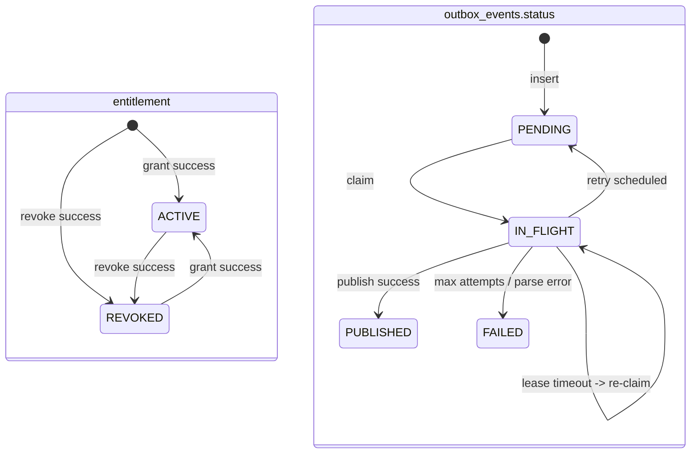
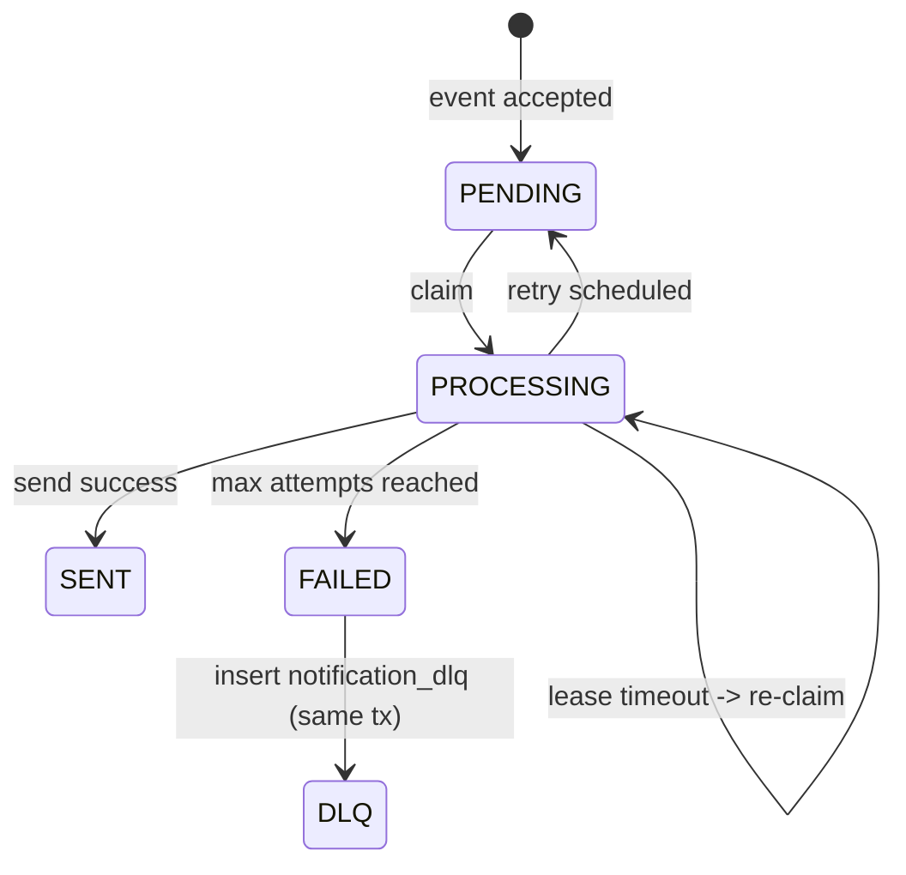

# components
## gateway-bff
- 認証・認可、レート制限、集約、クライアント差分吸収
- 認証認可セキュリティ

### 実装内容
- /loginから Spring security で認証、keycloakへリダイレクト
- /v1/me で account app で認証情報を登録、取得
- matchmaking へのアクセス認証後経由
- account, entitlement, matchmakingの情報を一度に取得するエンドポイント作成

## account
- IdPの認証後、システム内部主キーに紐づける

### 実装内容
- gateway-bffからのアクセスでuserを登録し、identity, roleと紐づけ
- ユーザ情報を返すAPI

## Entitlement
- 購入サービスから届くイベントをAPI等で受け止める
- Notification Service活用のため、権利付与時にアウトボックスで通知

### 実装内容
- grant/revoke APIでRDB(正本)と outbox に保存
- outboxからワーカーが作業中であるとclaimしNATSへ送信(時間切れでleaseされ再び処理可能に)
    - SELECT ... FOR UPDATE SKIP LOCKED で未処理行をロックし、IN_FLIGHT + lease_until + locked_by を更新
    - 送信成功後に PUBLISHED へ遷移
- 一定期間でoutboxをクリーンアップ

### 状態遷移（entitlement / outbox）

| 対象 | 状態 | 遷移契機 |
|---|---|---|
| entitlement | ACTIVE | grant成功（既存REVOKEDからの復帰含む） |
| entitlement | REVOKED | revoke成功（既存ACTIVEからの剥奪含む） |
| outbox | PENDING | 初期登録、または publish失敗時の再試行戻し |
| outbox | IN_FLIGHT | ワーカーがclaim（`FOR UPDATE SKIP LOCKED` + lease） |
| outbox | PUBLISHED | JetStream publish成功 |
| outbox | FAILED | 最大試行到達、またはpayloadパース不能 |

## Notification
- クライアントへの通知
- 他のサービスからイベントを受け取って通知

### 実装内容
- NATS からイベントをサブスクライブし、RDBへ
- RDBを作業中だとclaimしクライアントへ送信(ただのログ)
- NATSへ2重送信されていてもat-least-once前提に1回となるよう調整
- RDBを一定期間でクリーンアップ

### 状態遷移（notification）
| 状態 | 遷移契機 |
|---|---|
| PENDING | 初期登録、または送信失敗後の再試行戻し |
| PROCESSING | ワーカーがclaim（`FOR UPDATE SKIP LOCKED` + lease） |
| SENT | 送信成功 |
| FAILED | 最大試行到達（同一トランザクションでDLQ登録） |
| DLQ（別テーブル） | `notification_dlq` に隔離保存（`notification_id` 一意） |

## Matchmaking
- マッチを希望するとユーザにチケットを配布
- キューの上位から2人マッチ
- マッチをNotificaitonへ通知

### 実装内容
- APIでユーザにチケットを発行し、Redisへ保存
- チケットをキューにinsert
- 定期的にキューから上位2人をマッチ(Lua scriptで原子的に)
- マッチしたらNotificationへ通知
